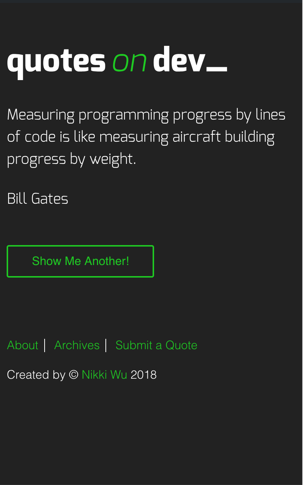

## Project 5 Quotes on Devs

Recreation of a REDAcademy "Quotes on Devs_" website. Quotes on devs allows the user to view quotes from other developers and also allows them to submit a quote! With this website users can enjoy some coding jokes and feel inspired to continue coding! 😁 

## Screenshots

# Desktop

# Tablet

# Mobile

## Created by

Nikki Wu Cohort Fall 2018

## Used 

* RED Quote on dev Starter

## Technologies used

* CSS
* HTML
* JavaScript
* JQuery
* Sass
* Wordpress 
* AJAX / JSON

## Personal Learning

* I was able to continue to practice my WordPress skills and AJAX / JSON APIs. 
* Continue to work on my CSS, HTML, JavaScript skills.
* Format my code to be less DRY. 

